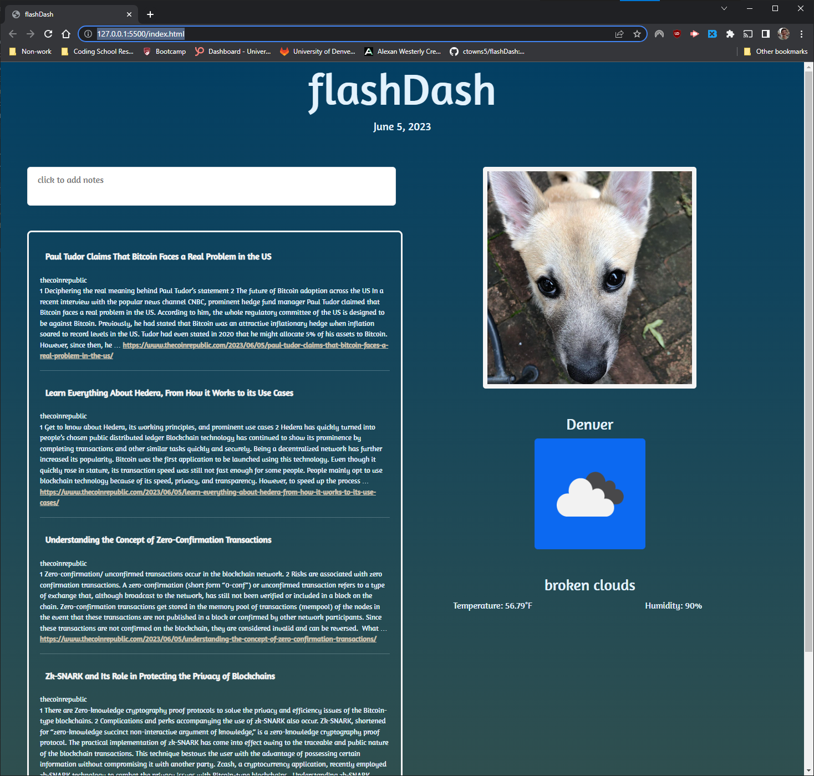

# flashDash

## Description

### https://ctowns5.github.io/flashDash/

flashDash is a quick dashboard for a user to access everything they need to start their day at the click of a button. It includes a notes app, weather, top stories, and a cute picture of a dog to bring a smile to your face so you can enter the day with a positive attitude and prepared for anything. The purpose of this project was to build a tool that could be useful to anyone, while also honing and practicing newly learned programming skills. As a first introduction to collaborative programming, it was a strong education in the use and implementation of git.

## Usage

The usage of this dash is fairly simple.

### Notes app

The notes app uses a clean interface to take and save notes. To enter a new note, click on the blank note at the bottom of the stack of existing notes. This will open the note for editing, as well as create a new blank note below it. If the user decides to exit the note without typing anything, the note will dissappear. In order to save the note, simply click off of the the entered note. When the text cursor leaves the entry area, all of the notes are saved to local memory. To delete a note, simply click the 'X' next to the note that you want to delete. The note will disappear and local memory will be updated to reflect the deleted note.

### Dog photo

The dog photo is very simple to use. Upon page load, the app will make an api call for a random dog picture and display it. To change the photo to another random photo, simply click the photo of the dog.

### News

The news app loads the top 5 news stories for the day, according to newsdata.io, along with links to visit their respective sites.

### Weather

The weather app displays the current weather for whatever location that the user enters. To change the location for the weather, click on the icon and enter the new desired location.

## Credits

### Contributors

Chris Townsend: https://github.com/ctowns5
Evan Mccullough: https://github.com/eqmccullough
Ian Smith: https://github.com/Ian-Smith1
Will Brown: https://github.com/TrueWillB

### APIs

- https://newsdata.io/
- https://dog.ceo/dog-api/
- https://openweathermap.org/api
